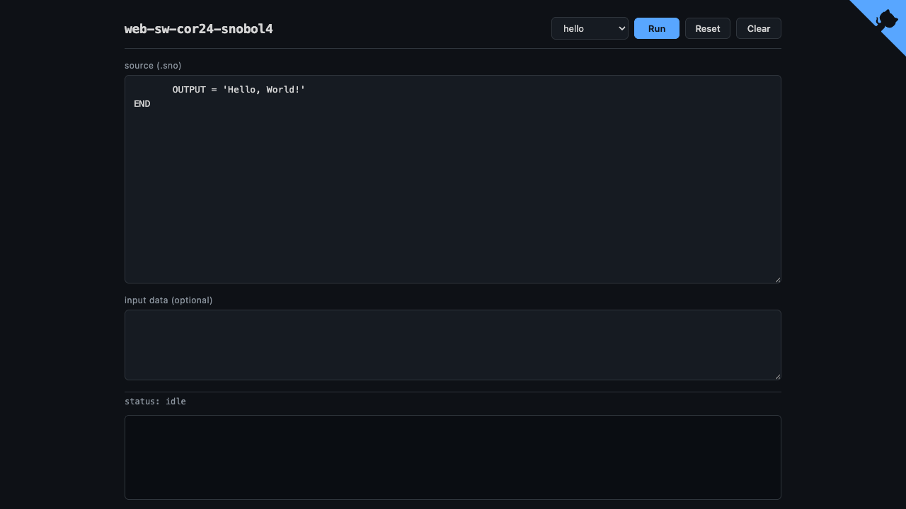

# web-sw-cor24-snobol4

Web UI for [sw-cor24-snobol4](https://github.com/sw-embed/sw-cor24-snobol4) on
COR24. Browser-based SNOBOL4 sandbox running on the COR24 emulator via Rust,
Yew, and WebAssembly. Pick a bundled demo (or paste your own SNOBOL4 source),
hit Run, and watch the program execute on a virtual 24-bit RISC CPU directly
in the browser.

**[Live Demo](https://sw-embed.github.io/web-sw-cor24-snobol4/)**



## Features

- **10 embedded demos** in alphabetical order: `array`, `break`, `concat`,
  `count`, `hello`, `hello-goto`, `input`, `multiply`, `span`, `span-fail`
  (the `input` demo also preloads `examples/input.dat`).
- **Batched execution** via `gloo` `Timeout` (200k instructions/tick) keeps
  the tab responsive on long programs.
- **Run / Stop** toggle, `Esc` to stop, `Ctrl/Cmd+Enter` to run.
- **Live status line**: instructions executed and elapsed milliseconds.
- **Budget control**: default 50M instructions; on exhaustion, an
  "Increase budget 4×" button re-runs with a higher cap.
- **Dark theme**, single-column 960px layout, monospace I/O panels.

## Embedded assets

The interpreter binary and demo programs are copied from
`../sw-cor24-snobol4` and embedded into the WASM bundle at compile time:

```sh
cp ../sw-cor24-snobol4/build/snobol4.bin assets/snobol4.bin
cp ../sw-cor24-snobol4/examples/{array,break,concat,count,hello,hello_goto,input,multiply,span,span_fail}.sno examples/
cp ../sw-cor24-snobol4/examples/input.dat examples/
```

`src/demos.rs` exposes them via `include_bytes!` / `include_str!` and a
`DEMOS` table sorted alphabetically by display name.

## Develop

```sh
trunk serve            # http://localhost:9136
trunk build --release --public-url /web-sw-cor24-snobol4/
cp -r dist/* pages/    # committed for GitHub Pages
```

## Related

- [sw-cor24-snobol4](https://github.com/sw-embed/sw-cor24-snobol4) — the SNOBOL4 implementation
- [sw-cor24-emulator](https://github.com/sw-embed/sw-cor24-emulator) — COR24 emulator (Rust)
- [web-sw-cor24-macrolisp](https://github.com/sw-embed/web-sw-cor24-macrolisp) — sister web UI for the Lisp implementation
